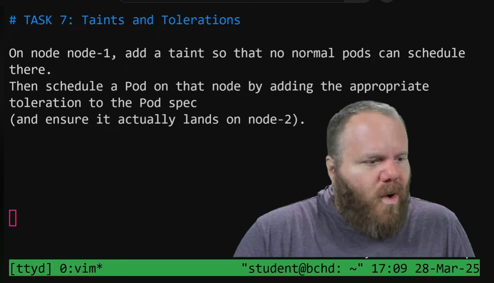

video: https://www.youtube.com/watch?v=eGv6iPWQKyo

run:

1. kubectl taint nodes node1 key1=value1:NoSchedule

2. kubectl describe node node1 (view tolerations)

3. then schedule a pod with the exact toleration of the node

4. kubectl apply -f pod.yaml

5. kubectl get pods (verify and make sure pod actually lands on node-2)

